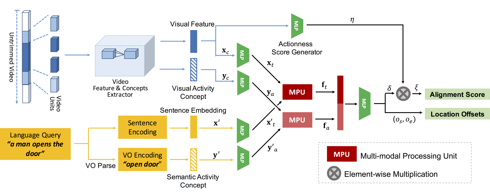

# MAC

By Runzhou Ge, [Jiyang Gao](https://jiyanggao.github.io/), [Kan Chen](http://wind09.github.io/), [Ram Nevatia](http://www-bcf.usc.edu/~nevatia/ram_nevatia.html).

University of Southern California (USC).

### Introduction
This repository contains the code for the WACV 2019 paper, *MAC: Mining Activity Concepts for Language-based Temporal Localization*. [arXiv](https://github.com/runzhouge/MAC)


<p align="center">
  
</p>


### Requirements
- Python 2.7
- Tensorflow 1.0 or higher
- others

### Download
The code is for [Charades-STA](https://arxiv.org/pdf/1705.02101.pdf) dataset.

After cloning this repo, please donwload: 
- [visual features](https://drive.google.com/open?id=1vFxDw4AkGVgfILH-6xaHofLZ7PbWwFC2)
- [visual activity concepts](https://drive.google.com/open?id=1biKPDmb7hbzowKLMIRSTLE0w_tWbGPAe)
- [ref_info](https://drive.google.com/open?id=16rFGu9rnhnH-WQeUmN7VtMgljrhGspll)

ref_info contains [Charades-STA annotations](https://github.com/jiyanggao/TALL/blob/master/README.md), semantic activity concepts, checkpoints and others. After downloading ref_info.tar, untar it and move the folder to the `root/` directory of this repo.

Please also change the visual feature and visual activity concepts directories in the `main.py`.


### Training
For the paper results on [Charades-STA](https://arxiv.org/pdf/1705.02101.pdf) dataset, run

```
python main.py --is_only_test True \
--checkpoint_path ./ref_info/charades_sta_wacv_2019_paper_ACL_k_results/trained_model.ckpt-10000 \
--test_name paper_results
```
You will get similar results listed in the row "ACL-K" of the following table.

| Model            | R@1,IoU=0.7 | R@1,IoU=0.5 | R@5,IoU=0.7 | R@5,IoU=0.5 |
| :--------------- | ----------: | ----------: | ----------: | ----------: | 
| [CTRL](https://github.com/jiyanggao/TALL/blob/master/README.md)|[7.15](https://github.com/jiyanggao/TALL/blob/master/README.md)|[21.42](https://github.com/jiyanggao/TALL/blob/master/README.md)|[26.91](https://github.com/jiyanggao/TALL/blob/master/README.md)|[59.11](https://github.com/jiyanggao/TALL/blob/master/README.md)|
| **ACL-K**        |   **12.20** |    **30.48**|    **35.13**|    **64.84**|


To train the model from scratch, run
```
python main.py
```

The results and checkpoints will appear in `root/results_history/` and `root/trained_save/`, respectively.

### Results Visualization

<p align="center">
  
</p>

### Citation
If you find this work is helpful, please cite:

```
@InProceedings{Ge_2019_WACV,
  author = {Ge, Runzhou and Gao, Jiyang and Chen, Kan and Nevatia, Ram},
  title = {MAC: Mining Activity Concepts for Language-based Temporal Localization},
  booktitle = {The IEEE Winter Conference on Applications of Computer Vision (WACV)},
  month = {January},
  year = {2019}
}
```
### License
[MIT License](LICENSE)


### Acknowledgements
This research was supported, in part, by the Office of Naval Research under grant N00014-18-1-2050 and by an Amazon Research Award.


